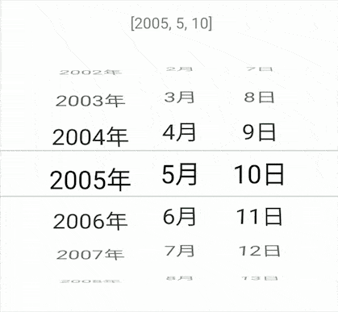
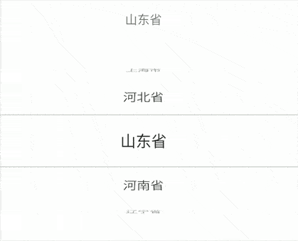
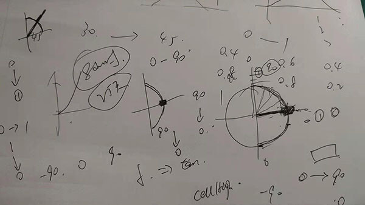

# Android 日期选择器 滚轮样式的选择器
DatePickerView [](https://jitpack.io/#limxing/DatePickerView)




PickerView  inside。




## Usage
#### Gradle

Project level build.gradle
```
allprojects {
    repositories {
        maven { url 'https://jitpack.io' }
    }
}
```
App level build.gradle
```
dependencies {
    implementation 'com.github.limxing:DatePickerView:1.0.1'
}
```

### XML
```
<top.leefeng.datepicker.DatePickerView
    android:id="@+id/datePickerView"
    android:layout_width="match_parent"
    android:layout_height="300dp"
   />

```
### Attribute
```
app:dpvBackgroundColor="#ffffff"        选中（中间条目）的背景色，默认透明
app:dpvDateEnd="2021-05-05"             截止日期，默认今天
app:dpvDatePaddingEnd="75dp"            右边距，默认0
app:dpvDatePaddingStart="75dp"          左边距，默认0
app:dpvDatePosition="2021-02-03"        定位日期，默认截止日期
app:dpvDateSize="7"                     当前课件范围内显示日期的个数，默认5          
app:dpvDateStart="1995-01-02"            开始日期，默认 1970-01-01
app:dpvDateTextColor="@color/black"     设置选中日期文本颜色，默认Color.BLACK
app:dpvDateTextSideColor="@color/black" 设置未选中日期两侧文本颜色，默认与dpvDateTextColor一致
app:dpvDateTextSize="24dp"              日期文字大小，默认 20dp
app:dpvLineColor="#33000000"            选中（中间条目）上下边界线颜色，默认透明
app:dpvLineWidth="1dp"                  选中（中间条目）上下边界线宽度，默认1dp
app:dpvUnitMarginStart="10dp"           如果年月日单位固定不滚动，设置单位与数字之间的距离，默认0
app:dpvUnitScroll="true"                是否设置单位（年月日）与数字一起滚动，默认false
app:dpvUnitTextColor="@color/black"     设置单位（年月日）及选中的日期文本颜色，默认与dpvDateTextColor一致
app:dpvUnitTextSize="20dp"              设置单位（年月日）文本大小，默认 18dp
app:dpvDateEnableAlpha="true"           是否透明度向两侧渐变，默认true
```


### Code

kotlin
```kotlin

//监听回调闭包
datePickerView.listener = {
     //[year,month,day]
}

//起止日期及当前定位日期
datePickerView.setDate("1990-01-01","2021-01-09","1999-09-09")

//需要进一步加工
datePickerView.drawListener = object : PickerView.DrawListener {
    /**
     * width recyclerView 宽
     * height recyclerView 高
     * cellHeight 选中View 高
     */
    override fun drawBelow(canvas: Canvas?, width: Int, height: Int, cellHeight: Int) {
        //按需要画背景
    }

    override fun drawOver(canvas: Canvas?, width: Int, height: Int, cellHeight: Int) {
        //按需要画前景。（有同学可能需要上下覆盖渐变效果，可在此实现,避免在此创建对象）
    }

}
```
SimplePickerView
```kotlin
 val list = listOf("北京市","天津市","上海市","河北省","山东省","河南省","辽宁省","江苏省","安徽省")
simplePicker.setData(list,3){
    //position
}
//进一步加工
simplePickerView.drawListener  //... 同上
```
java
```java
//什么？都2021年了你还在使用JAVA。Kotlin与JAVA 兼容，请自行Google。
```

### 实现原理

> Android发展的这么多年，很多Android开发者包括我面对做一个与IOS滚轮选择器UI时，各种搜索，
不难发现很多前辈为此付出了不少努力。有反编译别人apk的，有继承View自定义的，简单点的使用ListView
或Recyclerview在其上画一个渐变蒙层。结果就是要么有BUG的，要么与UI不符，还有的滑动时错位的。
> 我也是一个比较懒的人。不想全部自定义View，毕竟列表这种事情,系统SDK控件Recyclerview已经做的不是很好了吗！
> 因此，我就在RecyclerView上下手找到突破口。

首先我们分析一下：

草稿：  


#### 1、UI效果：
- 角度：滚轮效果上来看就是一个半圆，从正面看，选中的条目x轴方向角度是0，其上方的条目x轴角度的方向应该是0 至 90°，其下方的角度应该是0 至 -90°
- 大小：选中的条目大小与设置的一致，从中间至上下逐渐变小
- 位置：当Item进行角度和大小的变换后，越远离选中条目的条目之间的距离越大，因此，我们要对item设置y轴的位移，

#### 2、如何在哪配置代码
分析：查看RecyclerView的源码，所有的Item的位置是由LinearLayoutManager管理的，  
但是界面的绘制还是在Recyclerview中，我们是否能够在绘制Item前对itemView进行配置呢？
当然可以，我们重写RecyclerView的dispatchDraw方法，这样绘制子View的工作就由我们来处理，
源码可见，绘制子View使用drawChild方法。因此我们继承RecyclerView命名PickerView并且重写dispatchDraw方法。

#### 3、核心代码实现
```kotlin
 override fun dispatchDraw(canvas: Canvas?) {
    children.forEach {
        //1、计算 0-1-0 变化因子
        val cellCenter = (it.top + it.bottom) / 2f
        var f = cellCenter / (measuredHeight / 2f)
        val revert = f > 1
        if (revert) f = 2 - f
        //2、计算缩放，此处以最小 0.7，并设置给view
        val scale = 0.7f + f * 0.3f
        if (scale.isNaN()) return
        it.scaleX = scale
        it.scaleY = scale
        //3、计算透明度，此处以最小 0.3，并设置给View
        it.alpha = 0.3f + f * 0.7f
        //4、计算旋转角度
        val degree = 90 - f * 90
        it.rotationX = if (revert) -degree else degree
        //5、计算位移距离
        if (degree < 90) {
            val s = degree.toInt() / 90f
            it.translationY = (if (revert) -(s.pow(3.0f)) else (s).pow(3.0f)) * it.height

        } else {
            it.translationY = if (revert) it.height / 1f else -it.height / 1f
        }
        //6、绘制此view，文本在分割线变化可参考源代码
        drawChild(canvas, it, drawingTime)
    }
}
```
#### 4、DatePickerView的实现

DatePickerView继承自ViewGroup，是一个常规的自定义View，有兴趣可以参考 [源码](https://github.com/limxing/DatePickerView/blob/master/datepicker/src/main/java/top/leefeng/datepicker/DatePickerView.kt) 。

本项目还提供了一个通用选择器：SimplePickerView,使用如上所述。
当然你还可以使用PickerView进行其他选择器的开发，例如时间选择器、省市联动选择器。

最后，如遇到bug请及时issue。希望能够对你有帮助。

## License
DatePickerView and PickerView is available under the MIT license.